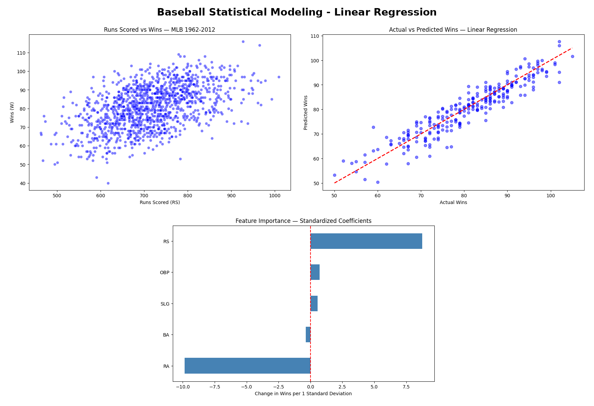

# Baseball Statistical Modeling - Linear Regression

## Project Overview
Applied Linear Regression to predict MLB team wins using batting and pitching statistics from the Moneyball dataset (1,232 team seasons, 1962-2012). Completed as part of the York University Big Data Analytics Certificate (2024).

## About This Project
Inspired by a regression assignment in the York University Big Data Analytics Certificate (2024). I built this notebook independently in 2026 using the public Moneyball dataset.

My contributions: I worked with my team on all stages of the project, including data preparation, analysis, and presenting findings.

In 2026, I re-ran and improved the analysis independently, standardizing the features before comparing coefficients, which corrected the feature importance findings.

## Tools Used
- Python
- Pandas
- Scikit-learn (Linear Regression, StandardScaler)
- Matplotlib
- Seaborn

## Model Performance
| Metric | Score |
|---|---|
| MAE | 3.24 wins |
| RMSE | 4.04 wins |
| R² Score | 0.868 (explains 86.8% of the variation in wins) |

## Key Insights

1. Runs Allowed (RA) has the strongest effect on wins, so preventing runs matters most
2. Runs Scored (RS) is the second strongest driver of wins
3. Once runs are in the model, OBP, SLG, and BA add very little, because they mainly affect wins by producing runs
4. Predictions are off by about 3 wins on average

## Method Note
Features were standardized before comparing coefficients, because runs (hundreds per season) and percentages (around 0.300) are measured on very different scales. Comparing raw coefficients would wrongly suggest OBP is the most important feature.

## Dataset
Moneyball MLB Stats 1962-2012 from Kaggle

## View Full Project on Kaggle
https://www.kaggle.com/code/lalitacanada/baseball-statistical-modeling-linear-regression
